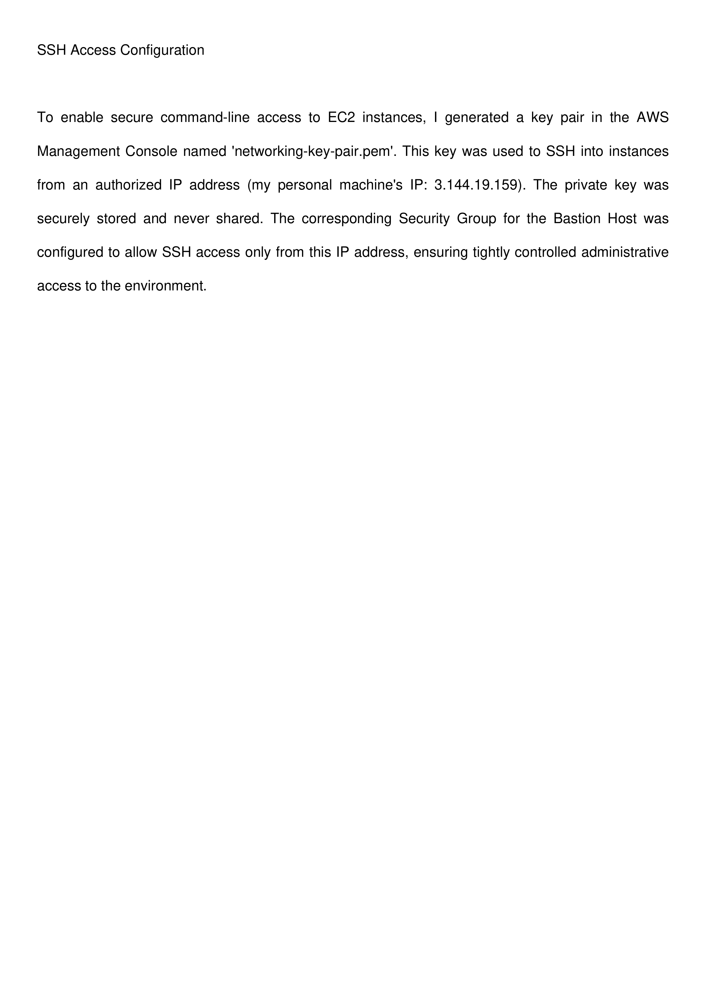
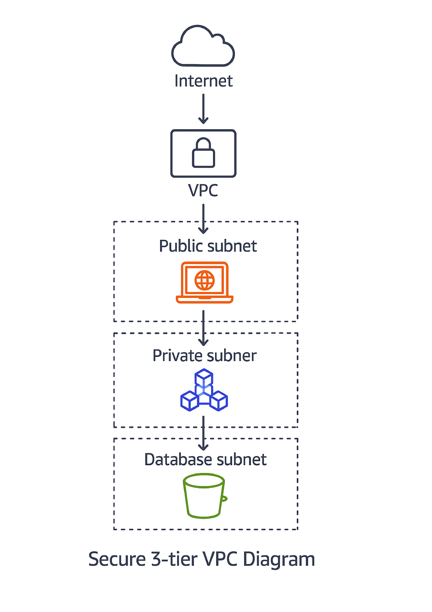

# AWS Secure 3-Tier Architecture and SSH Hardening

## Overview
This project demonstrates how to design and deploy a secure 3-tier cloud infrastructure in AWS. Best practices were used to configure the environment with network segmentation, access control, and secure administrative access.

The architecture isolates resources into public and private layers and implements least-privilege access using security groups and SSH.

---

## Objective
In order to create a secure AWS environment that:

- Segments network layers (web, application, database)
- Prevents unauthorized access using security groups
- Secures administrative access with SSH keys
- Demonstrates real-world cloud security best practices

---

## Architecture Design
The infrastructure consists of three layers:

- **Public Subnet (Web Layer):** Hosts internet-facing resources  
- **Private Subnet (Application Layer):** Handles internal application logic  
- **Private Subnet (Database Layer):** Stores sensitive data securely with no public access  

---

## Key Features

- Created a custom VPC with subnet segmentation
- Configured security groups with least-privilege access
- Implemented SSH key-based authentication
- Restricted SSH access to a trusted IP address
- Deployed and tested a web server on the public subnet
- Blocked direct access to private resources

---

## Security Implementation

- SSH access restricted to authorized IP only
- Private keys securely managed and not shared
- Security groups act as virtual firewalls
- Network segmentation reduces attack surface
- No direct public access to application or database layers

---

## SSH Configuration

EC2 access was secured using SSH key authentication. Only a single trusted IP address was allowed to connect, ensuring controlled administrative access.

---

## Screenshots

### Web Server Deployment

### Architecture Diagram

---

## Technologies Used

- AWS (VPC, EC2, Subnets, Security Groups)
- SSH (Key-Based Authentication)
- Networking Concepts (CIDR, Subnetting)
- Cloud Security Best Practices

---

## Outcome

This project demonstrates the ability to design and secure cloud infrastructure using AWS. It highlights skills in network segmentation, access control, and secure system administration.

---

## Relevance

This project is relevant to roles in:

- IT Support
- Systems Administration
- Cloud Engineering
- Cybersecurity

---

## Author

**Britany Walker**  
IT Support | Systems Administration | Cybersecurity
